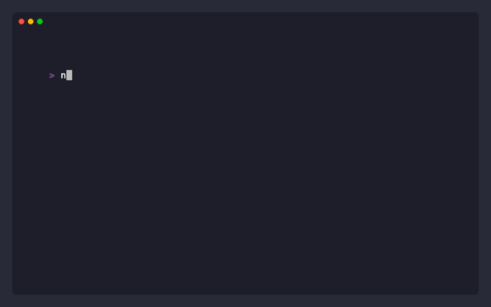

# Mastermind

Mastermind is a code-breaking game between a codemaker and a codebreaker
implemented in the Rust programming language meant as a simple TUI game.



## Installation

```sh
nix run github:mahyarmirrashed/mastermind
```

## License

[MIT License](./LICENSE)
